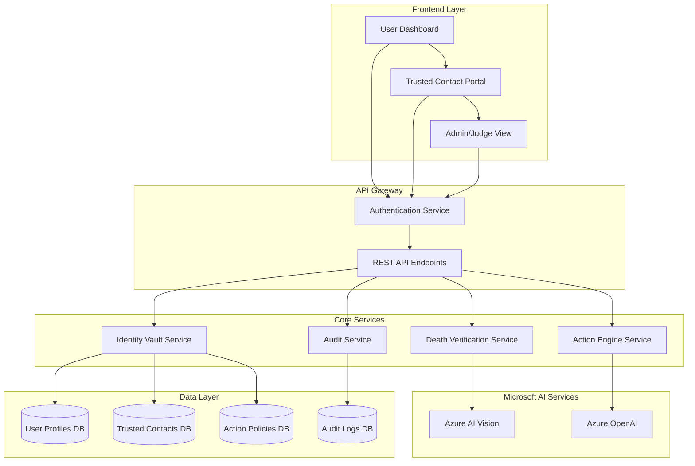

# Design Document

## Overview

The Ghost Identity Protection System is a comprehensive cybersecurity solution that leverages Microsoft AI services to detect death events and automatically manage digital assets according to user-defined policies. The system consists of a secure backend with tamper-proof audit logging, two integrated Microsoft AI services for document verification and policy execution, and a multi-role frontend dashboard for users, trusted contacts, and administrators.

## Architecture

The system follows a modular, cloud-native architecture hosted on Microsoft Azure:



## Components and Interfaces

### 1. Database Schema Design

#### User Profiles Table
```sql
CREATE TABLE user_profiles (
    user_id UUID PRIMARY KEY,
    email VARCHAR(255) UNIQUE NOT NULL,
    full_name VARCHAR(255) NOT NULL,
    date_of_birth DATE NOT NULL,
    encrypted_metadata JSONB, -- Stores encrypted account details
    status ENUM('active', 'deceased', 'suspended') DEFAULT 'active',
    created_at TIMESTAMP DEFAULT NOW(),
    updated_at TIMESTAMP DEFAULT NOW()
);
```

#### Trusted Contacts Table
```sql
CREATE TABLE trusted_contacts (
    contact_id UUID PRIMARY KEY,
    user_id UUID REFERENCES user_profiles(user_id),
    contact_name VARCHAR(255) NOT NULL,
    contact_email VARCHAR(255) NOT NULL,
    contact_phone VARCHAR(20),
    relationship VARCHAR(100),
    verification_status ENUM('pending', 'verified', 'revoked') DEFAULT 'pending',
    created_at TIMESTAMP DEFAULT NOW()
);
```

#### Action Policies Table
```sql
CREATE TABLE action_policies (
    policy_id UUID PRIMARY KEY,
    user_id UUID REFERENCES user_profiles(user_id),
    asset_type ENUM('email', 'bank', 'social_media', 'other'),
    platform_name VARCHAR(100) NOT NULL,
    account_identifier VARCHAR(255) NOT NULL,
    action_type ENUM('delete', 'memorialize', 'transfer', 'lock') NOT NULL,
    policy_details JSONB, -- Natural language policy and specific instructions
    priority INTEGER DEFAULT 1,
    created_at TIMESTAMP DEFAULT NOW()
);
```

#### Tamper-Proof Audit Logs Table
```sql
CREATE TABLE audit_logs (
    log_id UUID PRIMARY KEY,
    user_id UUID REFERENCES user_profiles(user_id),
    event_type VARCHAR(100) NOT NULL,
    event_description TEXT NOT NULL,
    ai_service_used VARCHAR(50), -- 'azure_vision', 'azure_openai', or NULL
    input_data JSONB,
    output_data JSONB,
    status ENUM('success', 'failure', 'pending') NOT NULL,
    timestamp TIMESTAMP DEFAULT NOW(),
    hash_signature VARCHAR(256) NOT NULL -- For tamper detection
);
```

### 2. Microsoft AI Vision Integration Service

#### Death Verification Module
```python
# death_verification.py
from azure.ai.vision.imageanalysis import ImageAnalysisClient
from azure.core.credentials import AzureKeyCredential
import os
import json
from typing import Dict, Optional

class DeathVerificationService:
    def __init__(self):
        self.endpoint = os.getenv('AZURE_VISION_ENDPOINT')
        self.key = os.getenv('AZURE_VISION_KEY')
        self.client = ImageAnalysisClient(
            endpoint=self.endpoint,
            credential=AzureKeyCredential(self.key)
        )
    
    def process_death_certificate(self, image_data: bytes) -> Dict:
        """
        Process death certificate using Azure AI Vision OCR
        Returns extracted name, date of death, and certificate ID
        """
        try:
            # Use Azure AI Vision to extract text
            result = self.client.analyze(
                image_data=image_data,
                visual_features=['READ']
            )
            
            extracted_text = self._extract_text_from_result(result)
            
            # Parse death certificate fields
            certificate_data = self._parse_death_certificate(extracted_text)
            
            return {
                'status': 'success',
                'extracted_data': certificate_data,
                'confidence_score': certificate_data.get('confidence', 0.0)
            }
            
        except Exception as e:
            return {
                'status': 'error',
                'error_message': str(e)
            }
    
    def verify_death_event(self, extracted_data: Dict, user_id: str) -> bool:
        """
        Cross-reference extracted data with Identity Vault database
        """
        # Query user profile from database
        user_profile = self._get_user_profile(user_id)
        
        if not user_profile:
            return False
        
        # Match full name and validate date format
        name_match = self._fuzzy_name_match(
            extracted_data.get('full_name', ''),
            user_profile['full_name']
        )
        
        date_valid = self._validate_death_date(
            extracted_data.get('date_of_death', '')
        )
        
        if name_match and date_valid:
            # Update user status to 'deceased'
            self._update_user_status(user_id, 'deceased')
            return True
        
        return False
```

### 3. Azure OpenAI Action Engine Service

#### Policy Interpretation and Execution Module
```python
# action_engine.py
from openai import AzureOpenAI
import os
import json
from typing import List, Dict

class ActionEngineService:
    def __init__(self):
        self.client = AzureOpenAI(
            api_key=os.getenv('AZURE_OPENAI_KEY'),
            api_version="2024-02-01",
            azure_endpoint=os.getenv('AZURE_OPENAI_ENDPOINT')
        )
        self.deployment_name = os.getenv('AZURE_OPENAI_DEPLOYMENT')
    
    def interpret_policies(self, user_policies: List[Dict]) -> List[Dict]:
        """
        Use Azure OpenAI to interpret natural language policies
        and generate structured action plans
        """
        interpreted_policies = []
        
        for policy in user_policies:
            prompt = self._create_policy_interpretation_prompt(policy)
            
            response = self.client.chat.completions.create(
                model=self.deployment_name,
                messages=[
                    {"role": "system", "content": "You are an AI assistant that interprets digital legacy policies and generates structured action plans."},
                    {"role": "user", "content": prompt}
                ],
                temperature=0.1
            )
            
            interpreted_policy = json.loads(response.choices[0].message.content)
            interpreted_policies.append(interpreted_policy)
        
        return interpreted_policies
    
    def generate_platform_notifications(self, policies: List[Dict], user_info: Dict) -> List[Dict]:
        """
        Generate professional notification emails/requests for third-party platforms
        """
        notifications = []
        
        for policy in policies:
            if policy['action_type'] in ['delete', 'memorialize', 'lock']:
                notification = self._generate_notification_for_platform(policy, user_info)
                notifications.append(notification)
        
        return notifications
    
    def _generate_notification_for_platform(self, policy: Dict, user_info: Dict) -> Dict:
        """
        Generate platform-specific notification using Azure OpenAI
        """
        prompt = f"""
        Generate a professional notification for {policy['platform_name']} to {policy['action_type']} 
        the account of {user_info['full_name']} who passed away on {user_info['date_of_death']}.
        
        Include:
        - Formal death notification
        - Account identifier: {policy['account_identifier']}
        - Requested action: {policy['action_type']}
        - Required documentation references
        - Contact information for follow-up
        
        Format as JSON with 'subject', 'body', and 'required_documents' fields.
        """
        
        response = self.client.chat.completions.create(
            model=self.deployment_name,
            messages=[
                {"role": "system", "content": "You are a professional legal assistant generating formal death notifications for financial and digital platforms."},
                {"role": "user", "content": prompt}
            ],
            temperature=0.2
        )
        
        notification_data = json.loads(response.choices[0].message.content)
        notification_data['platform'] = policy['platform_name']
        notification_data['policy_id'] = policy['policy_id']
        
        return notification_data
```

### 4. Frontend Dashboard Architecture

#### User Dashboard (Vault Management)
- **Vault Page**: Interface for adding digital assets (email, bank, social media accounts)
- **Legacy Page**: Policy configuration interface with Delete/Memorialize/Transfer options
- **Trusted Contacts**: Management interface for designating and verifying trusted contacts
- **Security Settings**: Multi-factor authentication and encryption key management

#### Trusted Contact Portal
- **Verification Upload**: Secure interface for uploading death certificates
- **Status Dashboard**: Real-time view of verification progress and policy execution
- **Communication Center**: Interface for receiving system notifications and updates

#### Admin/Judge View (MVP Demonstration)
- **Before/After States**: Visual comparison showing digital asset status changes
- **AI Decision Trail**: Detailed view of Azure AI Vision and OpenAI processing results
- **Audit Log Viewer**: Comprehensive audit trail with tamper-proof verification
- **System Metrics**: Performance and reliability statistics for technical review

## Data Models

### User Profile Model
```typescript
interface UserProfile {
  userId: string;
  email: string;
  fullName: string;
  dateOfBirth: Date;
  encryptedMetadata: EncryptedAssetData;
  status: 'active' | 'deceased' | 'suspended';
  createdAt: Date;
  updatedAt: Date;
}

interface EncryptedAssetData {
  emailAccounts: EncryptedAccount[];
  bankAccounts: EncryptedAccount[];
  socialMediaAccounts: EncryptedAccount[];
}
```

### Action Policy Model
```typescript
interface ActionPolicy {
  policyId: string;
  userId: string;
  assetType: 'email' | 'bank' | 'social_media' | 'other';
  platformName: string;
  accountIdentifier: string;
  actionType: 'delete' | 'memorialize' | 'transfer' | 'lock';
  policyDetails: {
    naturalLanguagePolicy: string;
    specificInstructions: string;
    conditions: string[];
  };
  priority: number;
  createdAt: Date;
}
```

### Audit Log Model
```typescript
interface AuditLog {
  logId: string;
  userId: string;
  eventType: string;
  eventDescription: string;
  aiServiceUsed?: 'azure_vision' | 'azure_openai';
  inputData: any;
  outputData: any;
  status: 'success' | 'failure' | 'pending';
  timestamp: Date;
  hashSignature: string;
}
```

## Correctness Properties

*A property is a characteristic or behavior that should hold true across all valid executions of a system-essentially, a formal statement about what the system should do. Properties serve as the bridge between human-readable specifications and machine-verifiable correctness guarantees.*

Based on the prework analysis, the following properties have been identified after eliminating redundancy:

### Property 1: OCR Extraction Consistency
*For any* valid death certificate document (PDF or image), the Azure AI Vision service should extract the deceased person's name, date of death, and certificate ID with consistent field mapping regardless of document format variations.
**Validates: Requirements 1.1**

### Property 2: Certificate Validation Determinism
*For any* death certificate data, validation against known standards should produce consistent results - the same certificate should always pass or fail validation deterministically.
**Validates: Requirements 1.2**

### Property 3: Death Event Creation Completeness
*For any* successfully validated death certificate, the system should create a complete death event record containing all required fields and immediately freeze all associated digital assets.
**Validates: Requirements 1.3, 1.5**

### Property 4: Error Handling Consistency
*For any* invalid certificate or system error, the system should return descriptive error messages and maintain system state integrity without partial updates.
**Validates: Requirements 1.4**

### Property 5: Asset Storage Encryption Round-Trip
*For any* digital asset stored in the system, encrypting then decrypting the sensitive information should produce equivalent data, and all sensitive fields should be encrypted at rest.
**Validates: Requirements 2.1, 2.2**

### Property 6: Contact Validation Completeness
*For any* trusted contact information provided, the system should validate all required fields and store complete emergency contact details with proper associations.
**Validates: Requirements 2.3**

### Property 7: Policy Association Integrity
*For any* action policy created, the system should maintain proper associations between policies, digital assets, and trusted contacts without orphaned references.
**Validates: Requirements 2.4**

### Property 8: AI Policy Interpretation Consistency
*For any* natural language action policy, the Azure OpenAI service should interpret the policy and generate structured action plans that preserve the original intent across multiple interpretations.
**Validates: Requirements 3.1**

### Property 9: Platform Notification Generation Completeness
*For any* policy execution (delete, memorialize, or lock), the Action Engine should generate platform-specific notifications containing all required documentation references and proper formatting.
**Validates: Requirements 3.2, 3.3, 8.1, 8.2**

### Property 10: Message Personalization Accuracy
*For any* deceased person's information and platform combination, generated notifications should include accurate personal details and follow platform-specific procedures.
**Validates: Requirements 3.4**

### Property 11: Ambiguity Detection Reliability
*For any* policy text that contains ambiguous language or conflicting instructions, the system should flag it for manual review rather than making incorrect assumptions.
**Validates: Requirements 3.5**

### Property 12: Audit Log Immutability
*For any* system state change, an immutable audit log entry should be created with complete information, and subsequent queries should verify log integrity through hash validation.
**Validates: Requirements 4.1, 4.2, 4.3, 4.4**

### Property 13: Service Degradation Resilience
*For any* Azure service unavailability, the system should gracefully degrade functionality, queue requests for retry, and implement proper error handling with exponential backoff.
**Validates: Requirements 5.3, 5.5, 8.4**

### Property 14: Authentication Security Enforcement
*For any* user attempting to access the vault, multi-factor authentication should be required, and unauthorized access attempts should be logged and reported.
**Validates: Requirements 6.1, 6.5**

### Property 15: Authorization Validation Accuracy
*For any* trusted contact attempting death verification, the system should validate their authorization against stored contact lists and prevent unauthorized actions.
**Validates: Requirements 6.2**

### Property 16: Data Encryption Consistency
*For any* sensitive data (personal information, credentials), the system should apply encryption consistently at rest and maintain data integrity through the encryption/decryption process.
**Validates: Requirements 6.3**

### Property 17: Language Consistency Enforcement
*For any* text, label, or message displayed by the system, the content should be in English only with no mixed-language content.
**Validates: Requirements 7.5**

### Property 18: Status Tracking Completeness
*For any* platform notification sent, the system should track response status and maintain accurate state information throughout the entire lifecycle.
**Validates: Requirements 8.3**

## Error Handling

### Azure Service Integration Errors
- **Azure AI Vision Failures**: Implement retry logic with exponential backoff, fallback to manual review queue
- **Azure OpenAI Failures**: Cache policy interpretations, provide manual override capabilities
- **Network Connectivity Issues**: Queue operations for retry, maintain offline capability for critical functions

### Data Integrity Errors
- **Database Transaction Failures**: Implement atomic operations with rollback capabilities
- **Encryption/Decryption Errors**: Maintain backup keys, implement key rotation procedures
- **Audit Log Tampering**: Implement hash chain verification, alert on integrity violations

### Authentication and Authorization Errors
- **Failed Authentication**: Implement account lockout policies, security event logging
- **Unauthorized Access Attempts**: Real-time alerting, automatic security response procedures
- **Trusted Contact Verification Failures**: Manual review process, multi-step verification

### Business Logic Errors
- **Policy Interpretation Ambiguity**: Flag for manual review, provide clarification workflows
- **Platform Integration Failures**: Maintain manual notification templates, escalation procedures
- **Asset Freezing Failures**: Implement compensating controls, audit trail maintenance

## Testing Strategy

### Dual Testing Approach
The system will employ both unit testing and property-based testing to ensure comprehensive coverage:

**Unit Tests**: Focus on specific examples, edge cases, and integration points between components. These tests will validate concrete scenarios and error conditions.

**Property-Based Tests**: Verify universal properties across all inputs using randomized test data. These tests will run a minimum of 100 iterations per property to ensure statistical confidence.

### Property-Based Testing Configuration
- **Framework**: Use `fast-check` for TypeScript/JavaScript components and `Hypothesis` for Python services
- **Test Iterations**: Minimum 100 iterations per property test
- **Test Tagging**: Each property test will reference its design document property using the format:
  - **Feature: ghost-identity-protection, Property 1: OCR Extraction Consistency**

### Testing Coverage Areas

#### Microsoft AI Service Integration Testing
- **Azure AI Vision**: Test OCR accuracy across various document formats, languages, and quality levels
- **Azure OpenAI**: Test policy interpretation consistency and notification generation quality
- **Service Resilience**: Test graceful degradation and retry mechanisms

#### Security and Encryption Testing
- **Data Encryption**: Verify encryption/decryption round-trip integrity for all sensitive data types
- **Authentication**: Test multi-factor authentication enforcement and session management
- **Authorization**: Test trusted contact validation and access control mechanisms

#### Database and Audit Testing
- **Data Integrity**: Test atomic operations and transaction rollback scenarios
- **Audit Logging**: Test tamper-proof logging and hash chain verification
- **Performance**: Test system performance under high load and concurrent access

#### Business Logic Testing
- **Policy Execution**: Test action policy interpretation and execution across all supported platforms
- **Asset Management**: Test digital asset registration, encryption, and lifecycle management
- **Notification Generation**: Test platform-specific notification formatting and delivery

### Integration Testing Strategy
- **End-to-End Workflows**: Test complete death verification and policy execution workflows
- **Cross-Service Integration**: Test interactions between all system components and external services
- **Error Recovery**: Test system recovery from various failure scenarios and partial state conditions

The testing strategy ensures that both specific examples work correctly (unit tests) and that universal properties hold across all possible inputs (property-based tests), providing comprehensive validation of system correctness and reliability.